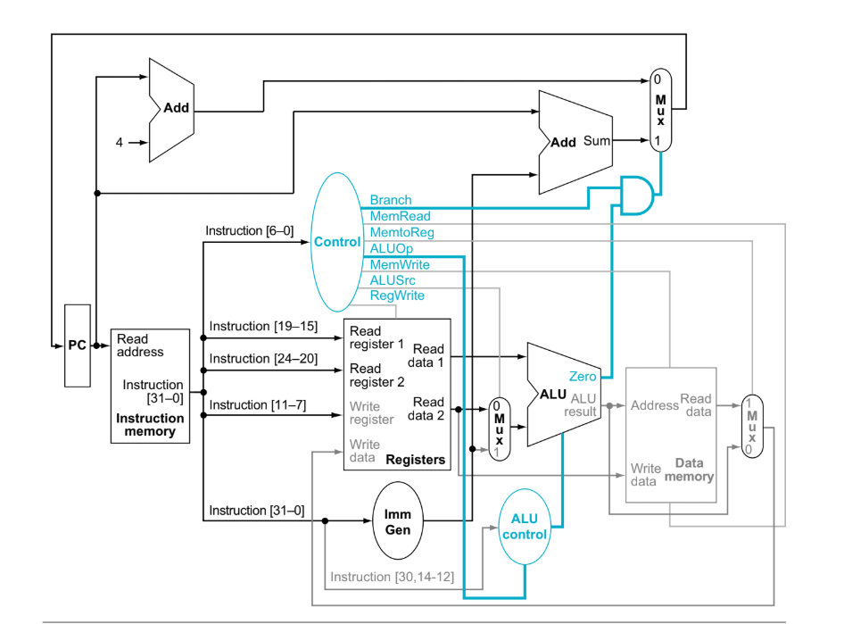

# RV32I Single-Cycle 32-bit RISC-V Processor

<p align="center">
  
</p>

## Overview

This project implements a **32-bit Single-Cycle RISC-V Processor** in **Verilog HDL** based on the **RV32I Base Integer Instruction Set Architecture (ISA)**.

The processor executes every instruction within **a single clock cycle**, meaning that instruction fetch, decode, execute, memory access, and register write-back are completed before the next clock edge.

The objective of this project is to understand the internal architecture of a RISC-V processor by implementing each hardware component from scratch using modular Verilog design practices.

The processor has been functionally verified using a comprehensive **self-checking Verilog testbench**, and simulation waveforms have been analyzed using **GTKWave** and **VaporView**.

---

# Project Highlights

* ✅ 32-bit RV32I Single-Cycle Processor
* ✅ Modular RTL Design
* ✅ Harvard Architecture
* ✅ Parameterized Register File
* ✅ Immediate Generator
* ✅ Centralized Control Unit
* ✅ Arithmetic Logic Unit (ALU)
* ✅ Branch Decision Unit
* ✅ Instruction Memory
* ✅ Data Memory
* ✅ Comprehensive Self-Checking Testbench
* ✅ Waveform Generation (VCD)
* ✅ Automated Build & Simulation Scripts
* ✅ GitHub Ready Project Structure

---

# Processor Architecture

The processor follows the classical **single-cycle datapath**, where every instruction completes during a single clock period.

The execution stages are:

```
Instruction Fetch (IF)
        │
        ▼
Instruction Decode (ID)
        │
        ▼
Execute (EX)
        │
        ▼
Memory Access (MEM)
        │
        ▼
Write Back (WB)
```

Unlike a pipelined processor, these stages are **not overlapped**. Only one instruction is active in the datapath at any given time.

---

# Processor Features

## Data Width

* 32-bit Architecture

## Instruction Set

* RV32I Base Integer ISA

## Register File

* 32 General Purpose Registers
* Two Read Ports
* One Write Port
* Register x0 Hardwired to Zero

## Memory Architecture

* Separate Instruction Memory
* Separate Data Memory

## Supported Immediate Formats

* I-Type
* S-Type
* B-Type
* U-Type
* J-Type

---

# Supported Instructions

## Arithmetic Instructions

| Instruction | Description   |
| ----------- | ------------- |
| ADD         | Addition      |
| SUB         | Subtraction   |
| ADDI        | Add Immediate |

---

## Logical Instructions

| Instruction | Description |
| ----------- | ----------- |
| AND         | Bitwise AND |
| OR          | Bitwise OR  |
| XOR         | Bitwise XOR |

---

## Shift Instructions

| Instruction | Description         |
| ----------- | ------------------- |
| SLL         | Shift Left Logical  |
| SRL         | Shift Right Logical |

---

## Comparison Instructions

| Instruction | Description   |
| ----------- | ------------- |
| SLT         | Set Less Than |

---

## Memory Instructions

| Instruction | Description |
| ----------- | ----------- |
| LW          | Load Word   |
| SW          | Store Word  |

---

## Branch Instructions

| Instruction | Description     |
| ----------- | --------------- |
| BEQ         | Branch if Equal |

---

## Jump Instructions

| Instruction | Description            |
| ----------- | ---------------------- |
| JAL         | Jump and Link          |
| JALR        | Jump and Link Register |

---

## Upper Immediate Instructions

| Instruction | Description               |
| ----------- | ------------------------- |
| LUI         | Load Upper Immediate      |
| AUIPC       | Add Upper Immediate to PC |

---

# Repository Structure

```text
RV32I-Single-Cycle/
│
├── RTL/
│   ├── 01.PC.v
│   ├── 02.Inst_Mem.v
│   ├── 03.Register.v
│   ├── 04.Immediate_Generate.v
│   ├── 05.Control_Unit.v
│   ├── 06.ALU.v
│   ├── 07.Data_Memory.v
│   ├── 08.Branch_Unit.v
│   └── RiscV_Core.v
│
├── Testbench/
│   ├── tb_riscv_core.v
│   ├── program.hex
│   └── Tb_README.md
│
├── Scripts/
│   └── run.py
│
├── Build/
│   ├── filelist.f 
│   └── sim.out
│
├── Waveforms/
│   ├── tb_riscv_core.vcd 
│   └── waveform.jpg
│
├── Docs/
│   ├── Block_Diagram.png 
│   └── RV32I.pdf
│
└── README.md
```

---

# RTL Module Description

| Module             | Description                                                              |
| ------------------ | ------------------------------------------------------------------------ |
| PC                 | Stores the current Program Counter and computes PC + 4                   |
| Inst_Mem           | Fetches instructions from instruction memory                             |
| Register           | Implements the 32 × 32-bit register file                                 |
| Immediate_Generate | Generates sign-extended immediates for all supported instruction formats |
| Control_Unit       | Decodes instructions and generates processor control signals             |
| ALU                | Performs arithmetic, logical, comparison, and address calculations       |
| Data_Memory        | Implements load and store operations                                     |
| Branch_Unit        | Determines branch conditions and computes branch targets                 |
| RiscV_Core         | Top-level module integrating all processor components                    |

---

# Verification

The processor has been verified using a dedicated self-checking testbench.

The verification program tests:

* Arithmetic Operations
* Logical Operations
* Shift Operations
* Comparison Operations
* Memory Read/Write
* Branch Instructions
* Jump Instructions
* Upper Immediate Instructions

The testbench automatically compares the processor outputs with the expected values and reports **PASS** or **FAIL** for each instruction.

Detailed documentation is available in:

```text
Testbench/README.md
```

---

# Tools Used

| Tool               | Purpose                 |
| ------------------ | ----------------------- |
| Verilog HDL        | RTL Design              |
| Icarus Verilog     | Simulation              |
| GTKWave            | Waveform Analysis       |
| VaporView          | VS Code Waveform Viewer |
| Visual Studio Code | Development Environment |
| Git                | Version Control         |

---

# Future Improvements

The current implementation serves as the foundation for future enhancements.

Planned improvements include:

* Five-Stage Pipeline Processor
* Forwarding Unit
* Hazard Detection Unit
* Branch Flush Logic
* Performance Optimization
* Cache Memory
* CSR Instruction Support
* Exception Handling

---

# Author

**Irfan Khan**

Electronics & Communication Engineering
National Institute of Technology Jalandhar

---

# License

This project is intended for educational and learning purposes. Feel free to use, modify, and extend the design with appropriate attribution.
